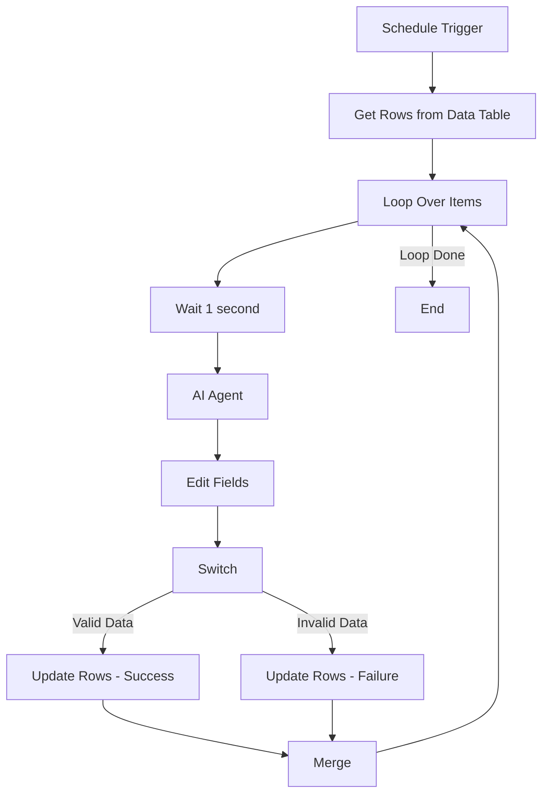

# Email & Website Finder Workflow

[](https://n8n.io)
[](https://opensource.org/licenses/MIT)

An intelligent n8n workflow automation for extracting email addresses and websites from Lithuanian company data using AI agents. Integrates with Google Sheets and Data Tables for automated contact information discovery.

## 📋 Overview

This workflow automates the process of finding and validating contact information (email addresses and websites) for Lithuanian companies. It uses AI-powered agents to intelligently search and extract authentic contact details while avoiding guesses or generic email addresses.

**Created by:** Naqash Thaheem  
**Last Updated:** November 12, 2025

## ✨ Features

- 🤖 **AI-Powered Extraction**: Uses Ollama (local LLM) and OpenAI for intelligent data extraction
- 📊 **Google Sheets Integration**: Reads company data from spreadsheets and updates results
- 🗄️ **Data Table Storage**: Stores and manages processed data in n8n Data Tables
- 🔄 **Automated Scheduling**: Runs on a scheduled basis for continuous processing
- ⏱️ **Rate Limiting**: Built-in delays to prevent API throttling
- ✅ **Validation**: Ensures only authentic, verified corporate emails are extracted
- 🔀 **Smart Routing**: Conditional logic for handling success/error cases
- 🔁 **Batch Processing**: Processes records in batches of 15 to optimize performance

## 🏗️ Workflow Architecture

### Main Components

1. **Schedule Trigger**
   - Automatically starts the workflow at set intervals
   - Configurable to run hourly or on custom schedules

2. **Get Rows (Data Table)**
   - Fetches company records from Data Table
   - Filters for unprocessed entries (empty Status and Website)
   - Limits to 2,100 records per execution

3. **Loop Over Items**
   - Iterates through company records
   - Batch size: 15 items at a time
   - Prevents overwhelming the system

4. **Wait Node**
   - Adds 1-second delay between requests
   - Prevents API rate limiting
   - Ensures stable processing

5. **AI Agent**
   - Powered by Ollama (qwen3-vl-30b model)
   - Intelligently searches for email and website information
   - Validates authenticity of found data

6. **HTTP Request Node**
   - Alternative processing using qwen3-coder-30b
   - Sends requests to local LLM endpoint
   - Temperature: 0.2 for consistent results
   - Max tokens: 800

7. **Edit Fields**
   - Parses and structures the AI output
   - Extracts Email, Website, and Row Number
   - Prepares data for database update

8. **Switch Node**
   - Routes data based on validation results
   - Checks if Website length > 5 characters
   - Handles both success and failure paths

9. **Update Operations**
   - Updates Data Table with results
   - Separate paths for:
     - **Success**: Stores found email/website + Status: "New Done"
     - **Failure**: Marks as "Not Found" + Status: "Not Found"

10. **Merge Node**
    - Combines results from both success/error paths
    - Consolidates final output
    - Continues loop for next batch

## 🔧 Technical Details

### AI Models Used

- **Primary Model**: `qwen/qwen3-vl-30b` (via Ollama)
- **Secondary Model**: `qwen/qwen3-coder-30b`
- **Local Endpoint**: `http://192.168.70.17:41234/v1`

### Data Table Schema

```json
{
  "CompanyName": "string",
  "Address": "string",
  "Website": "string",
  "email": "string",
  "Status": "string",
  "SheetRowNumber": "string",
  "SheetName": "string"
}
```

### Google Sheets Configuration

- **Document ID**: `1lnP5DapF5GlWcbRCrGVxyAS9p91k3hVANVahVXHOFbQ`
- **Sheet Name**: `contactdetails 10 24 - contactdetails`
- **Filter**: Status = "No"

## 🚀 Installation & Setup

### Prerequisites

- n8n instance (self-hosted or cloud)
- Google Sheets API credentials
- Ollama running locally with required models
- OpenAI API key (optional, for validation)

### Step 1: Install n8n

```bash
# Using npm
npm install -g n8n

# Or using Docker
docker run -it --rm \
  --name n8n \
  -p 5678:5678 \
  -v ~/.n8n:/home/node/.n8n \
  n8nio/n8n
```

### Step 2: Setup Ollama

```bash
# Install Ollama
curl -fsSL https://ollama.com/install.sh | sh

# Pull required models
ollama pull qwen/qwen3-vl-30b
ollama pull qwen/qwen3-coder-30b

# Start Ollama server
ollama serve
```

### Step 3: Configure Google Sheets

1. Go to [Google Cloud Console](https://console.cloud.google.com/)
2. Create a new project or select existing
3. Enable Google Sheets API
4. Create OAuth 2.0 credentials
5. Add credentials to n8n:
   - Go to n8n → Credentials
   - Add "Google Sheets OAuth2 API"
   - Follow authorization flow

### Step 4: Import Workflow

1. Download `Email-Website-Finder-Workflow-Data-Tables-1.json`
2. In n8n, go to Workflows
3. Click "Import from File"
4. Select the downloaded JSON file
5. Update configuration:
   - Google Sheets Document ID
   - Ollama endpoint URL
   - Data Table ID

### Step 5: Create Data Table

1. In n8n, go to Data Tables
2. Create new table: `contactdetails 11 02 - contactdetails`
3. Add columns as per schema above
4. Copy Table ID to workflow nodes

## 📖 Usage

### Manual Execution

1. Open the workflow in n8n
2. Click "Execute Workflow" button
3. Monitor execution in real-time
4. Check Data Table for results

### Scheduled Execution

1. The workflow is configured with Schedule Trigger
2. Default: Runs every hour
3. Modify schedule in "Schedule Trigger" node
4. Activate workflow to enable scheduling

### Input Data Format

Your Google Sheet or Data Table should contain:

```
CompanyName | Address | Status
Gimbul      | Smilynės g. 49, LT-35119 Panevėžys | No
Example Corp | Vilnius g. 10, LT-01234 Vilnius | No
```

### Output Format

After processing:

```
CompanyName | Address | Website | Email | Status
Gimbul      | Smilynės g. 49... | https://gimbul.lt | info@gimbul.lt | New Done
Example Corp | Vilnius g. 10... | Not Found | Not Found | Not Found
```

## 🎯 Workflow Logic



## 🔍 AI Extraction Rules

The AI agent follows strict guidelines:

1. **Website Identification**
   - Identifies official company website
   - Validates domain authenticity
   - Returns empty string if not found

2. **Email Validation**
   - Only authentic, verified corporate emails
   - **Excludes**: 
     - Personal emails (gmail, yahoo, outlook)
     - Generic non-domain-matching emails
     - Guessed or assumed addresses
   - Returns empty string if no valid email found

3. **No Assumptions**
   - Never invents data
   - Only returns verified information
   - Preserves exact row numbers

## 📊 Performance Metrics

- **Batch Size**: 15 records per iteration
- **Processing Speed**: ~1-2 seconds per record
- **Max Records**: 2,100 per execution
- **Success Rate**: Depends on data availability
- **Error Handling**: Automatic retry on network failures

## 🛠️ Customization

### Adjust Batch Size

In "Loop Over Items" node:
```json
{
  "batchSize": 15  // Change to desired size
}
```

### Modify Schedule

In "Schedule Trigger" node:
```json
{
  "rule": {
    "interval": [
      {
        "field": "hours"  // Options: minutes, hours, days
      }
    ]
  }
}
```

### Change AI Model

In "Run Model with Dynamic Inputs" node:
```json
{
  "model": "qwen/qwen3-vl-30b"  // Change model name
}
```

### Update Wait Time

In "Wait" node:
```json
{
  "amount": 1  // Seconds to wait
}
```

## 🐛 Troubleshooting

### Common Issues

**1. AI Agent Not Responding**
- Check if Ollama is running: `ollama list`
- Verify endpoint URL is correct
- Ensure model is downloaded

**2. Google Sheets Connection Failed**
- Re-authorize credentials in n8n
- Check document sharing permissions
- Verify Document ID is correct

**3. Data Table Empty**
- Confirm table ID matches in workflow
- Check filter conditions
- Verify data exists in source

**4. No Results Found**
- Review AI prompt instructions
- Check company name spelling
- Verify internet connectivity for web searches

**5. Rate Limiting Errors**
- Increase wait time between requests
- Reduce batch size
- Check API quota limits

## 📝 Best Practices

1. **Data Quality**
   - Ensure company names are accurate
   - Include full addresses for better results
   - Remove duplicates before processing

2. **Performance**
   - Start with small batches for testing
   - Monitor execution time
   - Adjust wait times based on API limits

3. **Maintenance**
   - Regularly update AI models
   - Clean up processed records
   - Archive old data

4. **Security**
   - Never commit credentials to repository
   - Use environment variables for sensitive data
   - Restrict API access appropriately

## 📄 License

MIT License - see [LICENSE](LICENSE) file for details

## 👤 Author

**Naqash Thaheem**

For questions or support, please open an issue in this repository.

## 🙏 Acknowledgments

- [n8n](https://n8n.io) - Workflow automation platform
- [Ollama](https://ollama.com) - Local LLM runtime
- [Qwen Models](https://github.com/QwenLM/Qwen) - AI language models

## 📚 Additional Resources

- [n8n Documentation](https://docs.n8n.io/)
- [Ollama Documentation](https://github.com/ollama/ollama)
- [Google Sheets API](https://developers.google.com/sheets/api)

---

**Note**: This workflow is specifically designed for Lithuanian companies but can be adapted for other regions by modifying the AI prompts and data sources.
